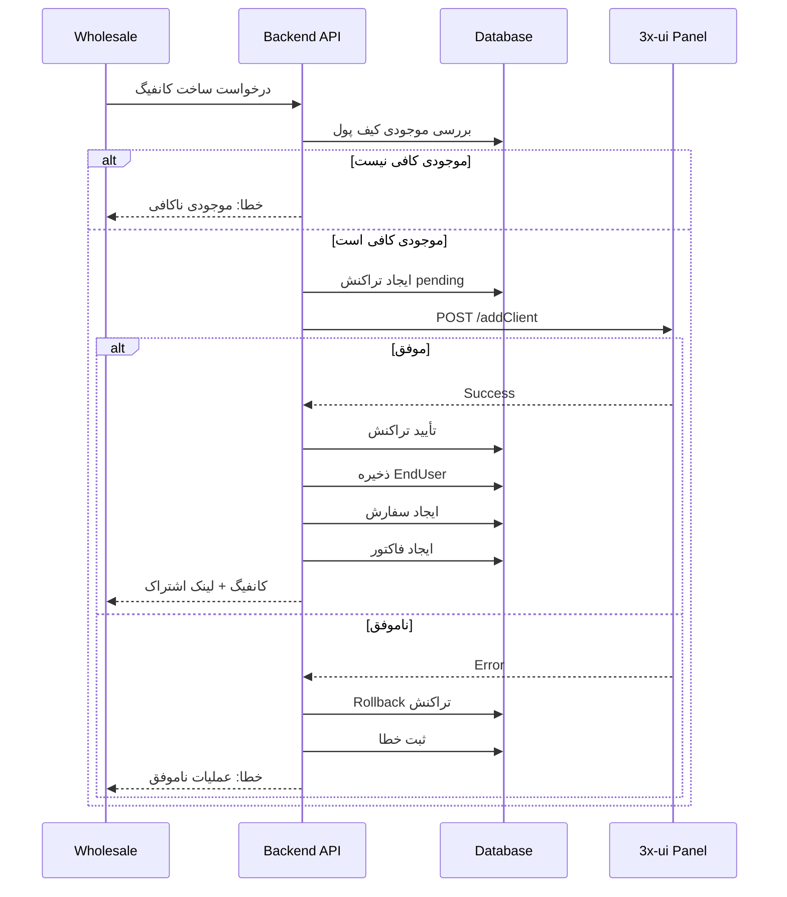

# 📊 داشبورد عمده‌فروشی 3x-ui

## 🎯 خلاصه پروژه

این پروژه یک داشبورد SaaS مدرن برای مدیریت فروش عمده سرویس‌های VPN بر پایه 3x-ui است. مشتریان عمده‌فروش به پنل اصلی 3x-ui دسترسی ندارند و فقط از طریق این داشبورد می‌توانند:

- کانفیگ جدید بسازند
- کاربران نهایی خود را مدیریت کنند
- سرویس‌ها را تمدید کنند
- موجودی کیف پول را مشاهده کنند
- فاکتورها و سفارشات را پیگیری کنند

---

## 🔌 API های واقعی 3x-ui v2.8.8

بر اساس بررسی سورس کد، این API ها در نسخه v2.8.8 موجود هستند:

### احراز هویت
| Method | Endpoint | توضیحات |
|--------|----------|---------|
| POST | `/login` | ورود و دریافت Session Cookie |

### Inbounds API (`/panel/api/inbounds`)
| Method | Endpoint | توضیحات |
|--------|----------|---------|
| GET | `/list` | لیست همه inbounds |
| GET | `/get/:id` | دریافت یک inbound |
| GET | `/getClientTraffics/:email` | ترافیک client با ایمیل |
| GET | `/getClientTrafficsById/:id` | ترافیک client با ID |
| POST | `/add` | افزودن inbound جدید |
| POST | `/del/:id` | حذف inbound |
| POST | `/update/:id` | بروزرسانی inbound |
| POST | `/addClient` | **افزودن client جدید** ⭐ |
| POST | `/updateClient/:clientId` | **بروزرسانی client** ⭐ |
| POST | `/:id/delClient/:clientId` | **حذف client** ⭐ |
| POST | `/:id/delClientByEmail/:email` | حذف client با ایمیل (v2.8+) |
| POST | `/:id/resetClientTraffic/:email` | ریست ترافیک |
| POST | `/clientIps/:email` | دریافت IP های client |
| POST | `/clearClientIps/:email` | پاک کردن IP ها |
| POST | `/onlines` | لیست کاربران آنلاین |
| POST | `/lastOnline` | آخرین وضعیت آنلاین |

### Server API (`/panel/api/server`)
| Method | Endpoint | توضیحات |
|--------|----------|---------|
| GET | `/status` | وضعیت سرور |
| GET | `/getNewUUID` | تولید UUID جدید |
| GET | `/getNewX25519Cert` | تولید کلید Reality |
| POST | `/restartXrayService` | ریستارت Xray |

### ⚠️ API هایی که وجود ندارند و باید خودمان بسازیم:
- ❌ مدیریت کیف پول
- ❌ قیمت‌گذاری
- ❌ سفارشات
- ❌ فاکتورها
- ❌ لاگ‌های امنیتی
- ❌ مدیریت کاربران پنل

---

## 🏗️ معماری پیشنهادی

### Backend: NestJS
- ماژولار و مقیاس‌پذیر
- Dependency Injection
- Guards و Interceptors داخلی
- پشتیبانی از TypeORM/Prisma/Drizzle

### Frontend: Next.js 14 + shadcn/ui
- App Router
- Server Components
- RTL Support
- Dark Mode

### Database: PostgreSQL + Drizzle ORM
- Type-safe
- سبک و سریع
- SQL-like syntax

### Cache: Redis
- Session management
- Rate limiting
- Job queues

---

## 💾 جداول اصلی دیتابیس

1. **users** - کاربران سیستم
2. **wholesale_customers** - مشتریان عمده‌فروش
3. **wallets** - کیف پول‌ها
4. **wallet_transactions** - تراکنش‌های مالی
5. **servers** - سرورهای 3x-ui
6. **inbounds** - پروتکل‌ها
7. **plans** - پلن‌های فروش
8. **customer_specific_prices** - قیمت‌گذاری اختصاصی
9. **end_users** - کاربران نهایی
10. **orders** - سفارشات
11. **invoices** - فاکتورها
12. **audit_logs** - لاگ‌های امنیتی

---

## 🔄 فرآیند ساخت کانفیگ جدید



---

## 🔐 امنیت

### سطوح دسترسی (RBAC)
| نقش | دسترسی‌ها |
|-----|----------|
| super_admin | همه چیز |
| admin | مشتریان، سفارشات، پلن‌ها، گزارشات |
| wholesale | فقط داده‌های خود |

### محافظت‌ها
- ✅ JWT Authentication
- ✅ Rate Limiting
- ✅ Input Validation (Zod)
- ✅ SQL Injection Prevention (ORM)
- ✅ XSS Protection
- ✅ CSRF Protection
- ✅ Idempotency Keys
- ✅ Audit Logging
- ✅ Encrypted Credentials

---

## 🚀 استقرار

### Docker Compose
```yaml
services:
  api:
    image: wholesale-api:latest
    env_file: .env.production
    
  web:
    image: wholesale-web:latest
    
  db:
    image: postgres:15
    volumes:
      - pgdata:/var/lib/postgresql/data
      
  redis:
    image: redis:7-alpine
```

### Environment Variables
```env
DATABASE_URL=postgresql://...
REDIS_URL=redis://...
JWT_SECRET=...
ENCRYPTION_KEY=...
THREEXUI_TIMEOUT=30000
```

---

## 📝 نتیجه‌گیری

این پروژه یک راه‌حل کامل برای فروش عمده سرویس‌های VPN ارائه می‌دهد. با استفاده از API های واقعی 3x-ui v2.8.8 و یک لایه میانی امن، مشتریان عمده‌فروش می‌توانند بدون دسترسی مستقیم به پنل، سرویس‌های خود را مدیریت کنند.

### فایل‌های مرتبط:
- [مستندات API 3x-ui](./3xui-api-v2.8.8.md)
- [طرح دیتابیس](./database-schema.md)
- [معماری سیستم](./architecture.md)
